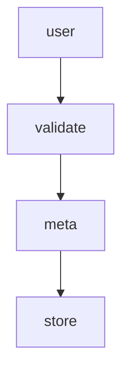
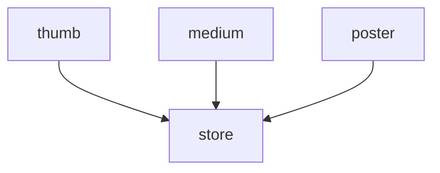
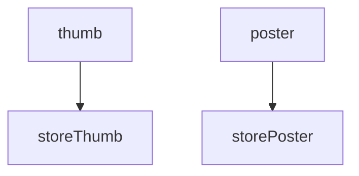

# Workflow

> 🔔 Subscribe to the [newsletter](https://chv.to/chevere-newsletter) to don't miss any update regarding Chevere.


[](https://github.com/chevere/workflow/actions)

[](LICENSE)
[](https://phpstan.org/)
[](https://dashboard.stryker-mutator.io/reports/github.com/chevere/workflow/0.9)

[](https://sonarcloud.io/dashboard?id=chevere_workflow)
[](https://sonarcloud.io/dashboard?id=chevere_workflow)
[](https://sonarcloud.io/dashboard?id=chevere_workflow)
[](https://sonarcloud.io/dashboard?id=chevere_workflow)
[](https://sonarcloud.io/dashboard?id=chevere_workflow)
[](https://sonarcloud.io/dashboard?id=chevere_workflow)
[](https://www.codefactor.io/repository/github/chevere/workflow)

## Summary

A Workflow is a configurable stored procedure that will run one or more jobs. Jobs are independent from each other, but interconnected as you can pass response references between jobs. Jobs supports conditional running based on variables and previous job responses.

## Installing

Workflow is available through [Packagist](https://packagist.org/packages/chevere/workflow) and the repository source is at [chevere/workflow](https://github.com/chevere/workflow).

```sh
composer require chevere/workflow
```

## What it does?

The Workflow package provides tooling for defining an execution procedure based on the [workflow pattern](https://en.wikipedia.org/wiki/Workflow_pattern). Its purpose is to abstract logic instructions as units of interconnected independent jobs.

Instead of building a monolithic procedure, you define a Workflow made of jobs, enabling developers to easy test and maintain re-usable multi-purpose logic.

::: tip 💡 Workflow introduction
 Read [Workflow for PHP](https://rodolfoberrios.com/2022/04/09/workflow-php/) at Rodolfo's blog for a compressive introduction to this package.
:::

## How to use

Workflow provides the following functions at the `Chevere\Workflow` namespace. Use these functions to define a Workflow, its variables and response references for named jobs.

| Function | Purpose                              |
| -------- | ------------------------------------ |
| workflow | Create workflow made of named jobs   |
| sync     | Create synchronous blocking job      |
| async    | Create asynchronous non-blocking job |
| variable | Define workflow-level variable       |
| response | Define a job response reference      |

* A Job is defined by its [Action](https://chevere.org/packages/action)
* Jobs are independent from each other, define shared variables using function `variable()`
* Reference {job#A response} -> {job#B input} by using function `response()`

To produce logic with this package:

1. Create a Workflow using function `workflow`
2. Define jobs using function `sync` or `async`
3. Run the Workflow using function `run`

## Creating Workflow

To create a Workflow define its named Jobs.

A [Job](#creating-job) is created by passing an [Action](https://chevere.org/packages/action) and its *expected* run arguments which can be raw values,  [Variables](#variable) and/or [Responses](#response) to another job's output.

The syntax for writing Workflow jobs require `name` for job's name, `sync/async` depending on job run method, and named `parameter` binding for each `Action::main` parameter.

```plain
<name>: <sync|async>(
    <action>,
    <parameter>: <variable|reference|raw>,
)
```

For example, for the given `MyAction` action:

```php
use function Chevere\Action\Action;

class MyAction extends Action
{
    protected function main(string $foo, string $bar): array
    {
        return [];
    }
}
```

You will be able to write a Workflow like this:

```php
use function Chevere\Workflow\sync;

workflow(
    greet: sync(
        new MyAction(),
        foo: variable('super'),
        bar: variable('taldo'),
    )
);
```

### With synchronous jobs

Use function `sync` to create a synchronous job, which block execution until it gets resolved.

In the example below a Workflow describes an image uploading procedure.

```php
use function Chevere\Workflow\sync;
use function Chevere\Workflow\response;
use function Chevere\Workflow\variable;
use function Chevere\Workflow\workflow;

workflow(
    user: sync(
        new GetUser(),
        request: variable('payload')
    ),
    validate: sync(
        new ValidateImage(),
        mime: 'image/png',
        file: variable('file')
    ),
    meta: sync(
        new GetMeta(),
        file: variable('file'),
    ),
    store: sync(
        new StoreFile(),
        file: variable('file'),
        name: response('meta', 'name'),
        user: response('user')
    ),
);
```

* `variable('payload')` and `variable('file')` declares a [Variable](#variable).
* `response('meta', 'name')` and `response('user')` declares a [Response](#response) reference.

The graph for this Workflow says that all jobs run one after each other as all jobs are defined using `sync`.



```php
$workflow->jobs()->graph()->toArray();
// contains
[
    ['user'],
    ['validate'],
    ['meta'],
    ['store']
];
```

To complete the example, here's how to [Run](#running-a-workflow) the Workflow previously defined:

```php
use function Chevere\Workflow\run;

run(
    $workflow,
    payload: $_REQUEST,
    file: '/path/to/file',
);
```

### With asynchronous jobs

Use function `async` to create an asynchronous job, which runs in parallel non-blocking.

In the example below a Workflow describes an image creation procedure for multiple image sizes.

```php
use function Chevere\Workflow\sync;
use function Chevere\Workflow\response;
use function Chevere\Workflow\variable;
use function Chevere\Workflow\workflow;

workflow(
    thumb: async(
        new ImageResize(),
        image: variable('image'),
        width: 100,
        height: 100,
        fit: 'thumb'
    ),
    medium: async(
        new ImageResize(),
        image: variable('image'),
        width: 500,
        fit: 'resizeByW'
    ),
    store: sync(
        new StoreFiles(),
        response('thumb', 'filename'),
        response('medium', 'filename'),
    ),
);
```

* `variable('image')` declares a [Variable](#variable).
* `response('thumb', 'filename')` and `response('medium', 'filename')` declares a [Response](#response) reference.

The graph for this Workflow says that `thumb`, `medium` and `poster` run non-blocking in parallel. Job `store` runs blocking (another node).



```php
$workflow->jobs()->graph()->toArray();
// contains
[
    ['thumb', 'medium', 'poster'],
    ['store']
];
```

To complete the example, here's how to [Run](#running-a-workflow) the Workflow previously defined:

```php
use function Chevere\Workflow\run;

run(
    workflow: $workflow,
    arguments: [
        'image' => '/path/to/file',
    ]
);
```

### Variable

Use function `variable` to declare a Workflow variable. This denotes a variable which must be injected by at Workflow run layer.

```php
use function Chevere\Workflow\variable;

variable('myVar');
```

### Response

Use function `response` to declare a Job response reference to a response returned by a previous Job.

🪄 When using a response it will **auto declare** the referenced Job as [dependency](#dependencies).

```php
use function Chevere\Workflow\response;

response(job: 'task');
```

References can be also made on a response member identified by `key`.

```php
use function Chevere\Workflow\response;

response(job: 'task', key: 'name');
```

## Creating Job

The `Job` class defines an [Action](https://chevere.org/packages/action) with arguments which can be passed passed "as-is", [variable](#variable) or [response](#response) on constructor using named arguments.

### Synchronous job

```php
use function Chevere\Workflow\job;

sync(
    new SomeAction(),
    ...$argument
);
```

### Asynchronous job

```php
use function Chevere\Workflow\job;

async(
    new SomeAction(),
    ...$argument
);
```

**Note:** Actions must support [serialization](https://www.php.net/manual/en/function.serialize.php) for being used on `async` jobs. For not serializable Actions as these interacting with connections (namely streams, database clients, etc.) you should use `sync` job.

### Job variables and references

```php
sync(
    new SomeAction(),
    context: 'public',
    role: variable('role'),
    userId: response('user', 'id'),
);
```

For the code above, argument `context` will be passed "as-is" (`public`) to `SomeAction`, arguments `role` and `userId` will be dynamic provided. When running the Workflow these arguments will be matched against the Parameters defined at the [main method](https://chevere.org/packages/action#mai-method) for `SomeAction`.

### Conditional running

Method `withRunIf` enables to pass arguments of type [Variable](#variable) or [Response](#response) for conditionally running a Job.

```php
sync(
    new CompressImage(),
    file: variable('file')
)
    ->withRunIf(
        variable('compressImage'),
        response('SomeAction', 'doImageCompress')
    )
```

For the code above, all conditions must meet to run the Job and both variable `compressImage` and the reference `SomeAction:doImageCompress` must be `true` to run the job.

### Dependencies

Use `withDepends` method to explicit declare previous jobs as dependencies. The dependent Job won't run until the dependencies are resolved.

```php
job(new SomeAction())
    ->withDepends('myJob');
```

## Running a Workflow

To run a Workflow use the `run` function by passing a Workflow and an `array` for its variables (if any).

```php
use function Chevere\Workflow\run;

$run = run($workflow, ...$variables);
```

Use `getResponse` to retrieve a job response as a `CastArgument` object which can be used to get a typed response.

```php
$string = $run->getResponse('myJob')->string();
```

## Code Examples

### Hello, world

Run live example: `php demo/hello-world.php Rodolfo` - [view source](./demo/hello-world.php)

The basic example Workflow defines a greet for a given username. The job `greet` is a named argument and it takes the `GreetAction` plus its [main method](https://chevere.org/packages/action#main-method) arguments.

```php
use Chevere\Demo\Actions\Greet;
use function Chevere\Workflow\run;
use function Chevere\Workflow\sync;
use function Chevere\Workflow\variable;
use function Chevere\Workflow\workflow;

$workflow = workflow(
    greet: sync(
        new Greet(),
        username: variable('username'),
    ),
);
```

The graph for this Workflow contains only the `greet` job.

```php
$workflow->jobs()->graph()->toArray();
// contains
[
    ['greet'],
];
```

Use function `run` to run the Workflow. Pass Workflow variables using named arguments.

```php
$run = run(
    $workflow,
    username: 'MyUsername'
);
```

### Async example

Run live example: `php demo/image-resize.php` - [view source](./demo/image-resize.php)

For this example Workflow defines an image resize procedure in two sizes. All jobs are defined as async, but as there are dependencies between jobs (see `variable` and `response`) the system resolves a suitable run strategy.

```php
use Chevere\Demo\Actions\ImageResize;
use Chevere\Demo\Actions\StoreFile;
use function Chevere\Workflow\async;
use function Chevere\Workflow\response;
use function Chevere\Workflow\run;
use function Chevere\Workflow\variable;
use function Chevere\Workflow\workflow;

$workflow = workflow(
    thumb: async(
        new ImageResize(),
        file: variable('image'),
        fit: 'thumbnail',
    ),
    poster: async(
        new ImageResize(),
        file: variable('image'),
        fit: 'poster',
    ),
    storeThumb: async(
        new StoreFile(),
        file: response('thumb'),
        path: variable('savePath'),
    ),
    storePoster: async(
        new StoreFile(),
        file: response('poster'),
        path: variable('savePath'),
    )
);
```

The graph for the Workflow above shows that `thumb` and `poster` run async, just like `storeThumb` and `storePoster` but the `store*` jobs run after the first dependency level gets resolved.



```php
$workflow->jobs()->graph()->toArray();
// contains
[
    ['thumb', 'poster'],
    ['storeThumb', 'storePoster']
];

Use function `run` to run the Workflow, variables are passed as named arguments.

```php
use function Chevere\Workflow\run;

$run = run(
    $workflow,
    image: '/path/to/image-to-upload.png',
    savePath: '/path/to/storage/'
);

// Alternative syntax
$variables = [
    'image' => '/path/to/image-to-upload.png',
    'savePath' => '/path/to/storage/'
];
$run = run($workflow, ...$variables);
```

Use `getReturn` to retrieve a job response as a `CastArgument` object which can be used to get a typed response.

```php
$thumbFile = $run->getReturn('thumb')->string();
```

### Conditional jobs

Run live example: `php demo/run-if.php` - [view source](./demo/run-if.php)

For this example Workflow defines a greet for a given username, but only if a `sayHello` variable is set to `true`.

```php
use Chevere\Demo\Actions\Greet;
use function Chevere\Workflow\run;
use function Chevere\Workflow\sync;
use function Chevere\Workflow\variable;
use function Chevere\Workflow\workflow;

/*
php demo/run-if.php Rodolfo
php demo/run-if.php
*/

$workflow = workflow(
    greet: sync(
        new Greet(),
        username: variable('username'),
    )->withRunIf(
        variable('sayHello')
    ),
);
```

Method `withRunIf` accepts one or more `variable` and `response` references. All conditions must be true at the same time for the job to run.

## Debugging Workflow

To debug a Workflow inspect the Jobs graph. It will show the job names and their dependencies for each execution level.

```php
$workflow->jobs()->graph()->toArray();
```

## Documentation

Documentation is available at [chevere.org/packages/workflow](https://chevere.org/packages/workflow).

## License

Copyright [Rodolfo Berrios A.](https://rodolfoberrios.com/)

This software is licensed under the Apache License, Version 2.0. See [LICENSE](LICENSE) for the full license text.

Unless required by applicable law or agreed to in writing, software distributed under the License is distributed on an "AS IS" BASIS, WITHOUT WARRANTIES OR CONDITIONS OF ANY KIND, either express or implied. See the License for the specific language governing permissions and limitations under the License.
