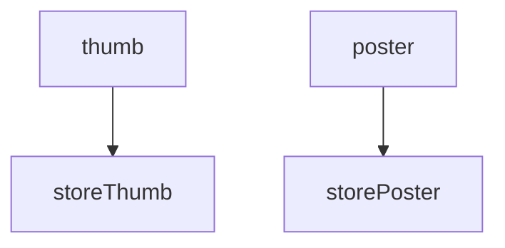

# Workflow

> 🔔 Subscribe to the [newsletter](https://chv.to/chevere-newsletter) to don't miss any update regarding Chevere.


[](https://github.com/chevere/workflow/actions)

[](LICENSE)
[](https://phpstan.org/)
[](https://dashboard.stryker-mutator.io/reports/github.com/chevere/workflow/0.9)

[](https://sonarcloud.io/dashboard?id=chevere_workflow)
[](https://sonarcloud.io/dashboard?id=chevere_workflow)
[](https://sonarcloud.io/dashboard?id=chevere_workflow)
[](https://sonarcloud.io/dashboard?id=chevere_workflow)
[](https://sonarcloud.io/dashboard?id=chevere_workflow)
[](https://sonarcloud.io/dashboard?id=chevere_workflow)
[](https://www.codefactor.io/repository/github/chevere/workflow)
[](https://app.codacy.com/gh/chevere/workflow/dashboard)


## Quick start

Install with [Composer](https://packagist.org/packages/chevere/workflow).

```sh
composer require chevere/workflow
```

Workflow provides the following functions at the `Chevere\Workflow` namespace:

| Function   | Purpose                              |
| ---------- | ------------------------------------ |
| `workflow` | Create workflow made of named jobs   |
| `sync`     | Create synchronous blocking job      |
| `async`    | Create asynchronous non-blocking job |
| `variable` | Define workflow-level variable       |
| `response` | Define a job response reference      |

* Jobs are independent from each other, define shared variables using function `variable`
* Reference [job A response] -> [job B input] by using function `response`

## Hello, world

See the live example at [demo/hello-world.php](demo/hello-world.php)

```php
use function Chevere\Workflow\workflow;
use function Chevere\Workflow\sync;

$workflow = workflow(
    greet: sync(
        new GreetAction(),
        username: variable('username'),
    ),
);
$run = run($workflow, [
    'username' => $argv[1] ?? 'Walala',
]);
echo $run->getResponse('greet')->string();
// Hello, Walala!
```

## Full example

See the live example at [demo/image-upload.php](demo/image-upload.php)

In this example all works are defined as async but as there are dependencies between jobs the system resolves a suitable run strategy.

```php
use function Chevere\Workflow\workflow;
use function Chevere\Workflow\async;
use function Chevere\Workflow\response;
use function Chevere\Workflow\variable;

$workflow = workflow(
    thumb: async(
        new ImageResize(),
        file: variable('image'),
        fit: 'thumbnail',
    ),
    poster: async(
        new ImageResize(),
        file: variable('file'),
        fit: 'poster',
    ),
    storeThumb: async(
        new StoreFile(),
        file: response('thumb'),
        path: variable('savePath'),
    ),
    storePoster: async(
        new StoreFile(),
        file: response('poster'),
        path: variable('savePath'),
    )
);
```

The graph for the Workflow above shows that `thumb` and `poster` run async, just like `storeThumb` and `storePoster` but the storage jobs run after the first dependency level gets resolved.



Use function `run` to run the Workflow:

```php
use function Chevere\Workflow\run;

$variables = [
    'image' => '/path/to/image-to-upload',
    'savePath' => '/path/to/storage/'
];
$run = run($workflow, $variables);
```

Use `$run->getResponse($job)` to retrieve a job response as a `CastArgument` object which can be used to get a typed response.

```php
$thumbFile = $run->getResponse('thumb')->string();
```

## Notes on async

Actions including any nested dependency must support serialization for being used on Workflows containing `async` jobs. If one of your Actions is not serializable, consider using `sync` for all your jobs.

## Documentation

Documentation is available at [chevere.org](https://chevere.org/packages/workflow).

## License

Copyright 2023 [Rodolfo Berrios A.](https://rodolfoberrios.com/)

This software is licensed under the Apache License, Version 2.0. See [LICENSE](LICENSE) for the full license text.

Unless required by applicable law or agreed to in writing, software distributed under the License is distributed on an "AS IS" BASIS, WITHOUT WARRANTIES OR CONDITIONS OF ANY KIND, either express or implied. See the License for the specific language governing permissions and limitations under the License.
