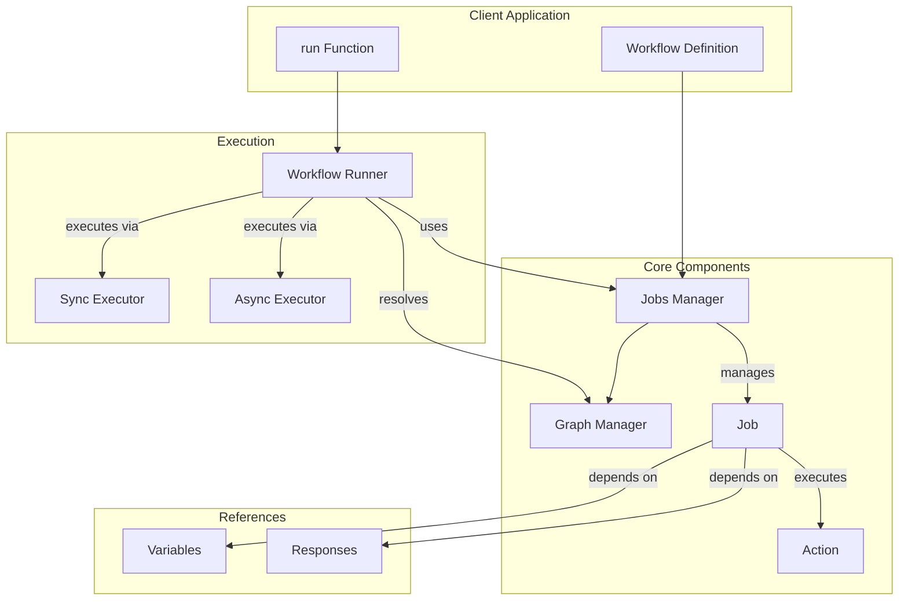
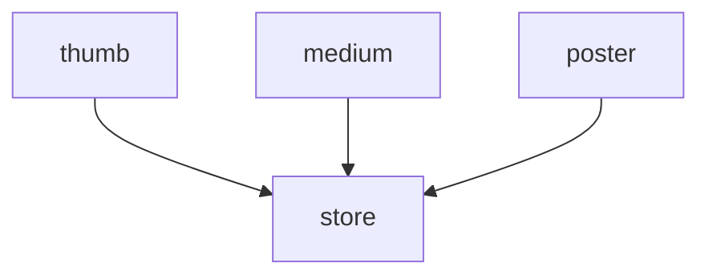
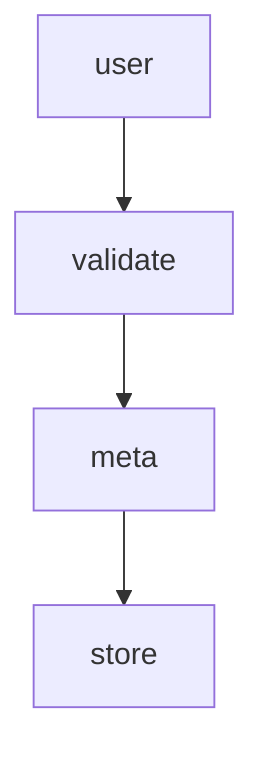

# Workflow


[](https://github.com/chevere/workflow/actions)

[](LICENSE)
[](https://phpstan.org/)
[](https://dashboard.stryker-mutator.io/reports/github.com/chevere/workflow/1.0)

[](https://sonarcloud.io/dashboard?id=chevere_workflow)
[](https://sonarcloud.io/dashboard?id=chevere_workflow)
[](https://sonarcloud.io/dashboard?id=chevere_workflow)
[](https://sonarcloud.io/dashboard?id=chevere_workflow)
[](https://sonarcloud.io/dashboard?id=chevere_workflow)
[](https://sonarcloud.io/dashboard?id=chevere_workflow)
[](https://www.codefactor.io/repository/github/chevere/workflow)

## Summary

A Workflow is a configurable stored procedure that will run one or more jobs. Jobs are independent from each other, but interconnected as you can pass response references between jobs. Jobs supports conditional running based on variables and previous job responses.

## Installing

Workflow is available through [Packagist](https://packagist.org/packages/chevere/workflow) and the repository source is at [chevere/workflow](https://github.com/chevere/workflow).

```sh
composer require chevere/workflow
```

## What it does?

The Workflow package provides a robust system for defining and executing structured procedures based on the [workflow pattern](https://en.wikipedia.org/wiki/Workflow_pattern). It enables you to organize complex logic into a series of interconnected, independent jobs that can be executed in a controlled manner.

By breaking down monolithic procedures into modular workflow jobs, developers gain several advantages:

* Improved testability of individual components
* Better code organization and maintainability
* Reusable job definitions across different workflows
* Clear visualization of process flows
* Flexible execution patterns (sync/async)

::: tip 💡 Workflow introduction
 Read [Workflow for PHP](https://rodolfoberrios.com/2022/04/09/workflow-php/) at Rodolfo's blog for a compressive introduction to this package.
:::

## Architecture


```mermaid
graph TD
    subgraph Client Application
        WF[Workflow Definition]
        Run[run Function]
    end

    subgraph Core Components
        Jobs[Jobs Manager]
        Graph[Graph Manager]
        Job[Job]
        Action[Action]
    end

    subgraph References
        Var[Variables]
        Resp[Responses]
    end

    subgraph Execution
        Runner[Workflow Runner]
        Sync[Sync Executor]
        Async[Async Executor]
    end

    WF --> Jobs
    Jobs --> Graph
    Jobs --> |manages| Job
    Job --> |executes| Action
    Job --> |depends on| Var
    Job --> |depends on| Resp
    Run --> Runner
    Runner --> |uses| Jobs
    Runner --> |resolves| Graph
    Runner --> |executes via| Sync
    Runner --> |executes via| Async
```

## How to use

The Workflow package provides a set of core functions in the `Chevere\Workflow` namespace that allow you to build and manage workflow processes. These functions work together to create flexible, maintainable workflow definitions.

### Functions

| Function | Purpose                                                    |
| -------- | :--------------------------------------------------------- |
| workflow | Creates a new workflow container for organizing named jobs |
| sync     | Defines a synchronous job that blocks until completion     |
| async    | Defines an asynchronous job that runs non-blocking         |
| variable | Declares a workflow-level variable for job inputs          |
| response | Creates a reference to access previous job outputs         |

### Key concepts

* [Job](#job): Self-contained unit of work defined by [Action](https://chevere.org/packages/action)
* [Variable](#variable): Shared workflow-level inputs accessed by multiple jobs
* [Response](#response): Links between job outputs (`response()`) and inputs

## Workflow example

`php demo/chevere.php`

Create `MyAction` action by extending `Chevere\Action\Action`. You can also `use ActionTrait`.

```php
use Chevere\Action\Action;

class MyAction extends Action
{
    protected function main(string $foo): string
    {
        return 'Hello, ' . $foo;
    }
}
```

Create Workflow with your `MyAction` Job:

```php
use function Chevere\Workflow\sync;
use function Chevere\Workflow\variable;
use function Chevere\Workflow\response;

$workflow = workflow(
    greet: sync(
        new MyAction(),
        foo: variable('super'),
    ),
    capo: sync(
        new MyAction(),
        foo: response('greet'),
    ),
);
```

Run the Workflow:

```php
use function Chevere\Workflow\run;

$hello = run(
    $workflow,
    super: 'Chevere',
);
echo $hello->response('greet')->string() . PHP_EOL;
// Hello, Chevere
echo $hello->response('capo')->string() . PHP_EOL;
// Hello, Hello, Chevere
```

## Variable

Use function `variable` to declare a Workflow variable that will be injected when running the workflow. Variables allow you to pass external values into your workflow jobs during execution.

```php
use function Chevere\Workflow\variable;

// Basic variable declaration
variable('myVar');

// Usage in a job
sync(
    new MyAction(),
    parameter: variable('myVar')
);
```

When running the workflow, you must provide values for all declared variables:

```php
use function Chevere\Workflow\run;

run($workflow, myVar: 'some value');
```

## Response

Use function `response` to declare a reference to a response returned by a previous Job. This allows you to chain job outputs as inputs to subsequent jobs.

🪄 When using a response it will **auto declare** the referenced Job as a [dependency](#dependencies), ensuring proper execution order.

```php
use function Chevere\Workflow\response;

// Basic response declaration
response('job1');

// Usage in a Workflow
workflow(
    job1: sync(
        new SomeAction(),
    ),
    job2: sync(
        new MyAction(),
        parameter: response('job1')
    );
);
```

References can be also made on a response member identified by `key`.

```php
use function Chevere\Workflow\response;

response('job1', 'id');
```

## Job

The `Job` class defines an [Action](https://chevere.org/packages/action) that can be executed as part of a workflow.

### Arguments

Job arguments can be passed in three ways:

* As-is values: Direct values passed to the Action
* [Variables](#variable): Workflow-level inputs
* [Responses](#response): References to previous job outputs

```php
sync(
    new SomeAction(),
    context: 'public',
    role: variable('role'),
    userId: response('user', 'id'),
);
```

For the code above, argument `context` will be passed "as-is" (`public`) to `SomeAction`, arguments `role` and `userId` will be dynamic provided. When running the Workflow these arguments will be matched against the Parameters defined at the [main method](https://chevere.org/packages/action#mai-method) for `SomeAction`.

### Asynchronous jobs

Use function `async` to create an asynchronous job, which runs non-blocking.

**Important:** When using `async` jobs, your Actions must support [serialization](https://www.php.net/manual/en/function.serialize.php). For Actions that work with non-serializable resources like:

* Database connections
* File handles
* Stream resources
* Network sockets

You must use `sync` jobs instead.

In the example below a Workflow describes an image creation procedure for multiple image sizes.

```php
use function Chevere\Workflow\sync;
use function Chevere\Workflow\response;
use function Chevere\Workflow\variable;
use function Chevere\Workflow\workflow;

workflow(
    thumb: async(
        new ImageResize(),
        image: variable('image'),
        width: 100,
        height: 100,
        fit: 'thumb'
    ),
    medium: async(
        new ImageResize(),
        image: variable('image'),
        width: 500,
        fit: 'resizeByW'
    ),
    store: sync(
        new StoreFiles(),
        response('thumb', 'filename'),
        response('medium', 'filename'),
    ),
);
```

* `variable('image')` declares a [Variable](#variable).
* `response('thumb', 'filename')` and `response('medium', 'filename')` declares a [Response](#response) reference.

The graph for this Workflow says that `thumb`, `medium` and `poster` run non-blocking in parallel. Job `store` runs blocking (another node).


```mermaid
graph TD;
    thumb-->store;
    medium-->store;
    poster-->store;
```

```php
$workflow->jobs()->graph()->toArray();
// contains
[
    ['thumb', 'medium', 'poster'],
    ['store']
];
```

To complete the example, here's how to [Run](#running-a-workflow) the Workflow previously defined:

```php
use function Chevere\Workflow\run;

run(
    workflow: $workflow,
    arguments: [
        'image' => '/path/to/file',
    ]
);
```

### Synchronous jobs

Use function `sync` to create a synchronous job, which block execution until it gets resolved.

In the example below a Workflow describes an image uploading procedure.

```php
use function Chevere\Workflow\sync;
use function Chevere\Workflow\response;
use function Chevere\Workflow\variable;
use function Chevere\Workflow\workflow;

workflow(
    user: sync(
        new GetUser(),
        request: variable('payload')
    ),
    validate: sync(
        new ValidateImage(),
        mime: 'image/png',
        file: variable('file')
    ),
    meta: sync(
        new GetMeta(),
        file: variable('file'),
    ),
    store: sync(
        new StoreFile(),
        file: variable('file'),
        name: response('meta', 'name'),
        user: response('user')
    ),
);
```

* `variable('payload')` and `variable('file')` declares a [Variable](#variable).
* `response('meta', 'name')` and `response('user')` declares a [Response](#response) reference.

The graph for this Workflow says that all jobs run one after each other as all jobs are defined using `sync`.


```mermaid
graph TD;
    user-->validate-->meta-->store;
```

```php
$workflow->jobs()->graph()->toArray();
// contains
[
    ['user'],
    ['validate'],
    ['meta'],
    ['store']
];
```

To complete the example, here's how to [Run](#running-a-workflow) the Workflow previously defined:

```php
use function Chevere\Workflow\run;

run(
    $workflow,
    payload: $_REQUEST,
    file: '/path/to/file',
);
```

### Conditional running

Method `withRunIf` enables to pass arguments of type [Variable](#variable) or [Response](#response) for conditionally running a Job.

```php
sync(
    new CompressImage(),
    file: variable('file')
)
    ->withRunIf(
        variable('compressImage'),
        response('SomeAction', 'doImageCompress')
    )
```

For the code above, all conditions must meet to run the Job and both variable `compressImage` and the reference `SomeAction:doImageCompress` must be `true` to run the job.

### Dependencies

Use `withDepends` method to explicit declare previous jobs as dependencies. The dependent Job won't run until the dependencies are resolved.

```php
job(new SomeAction())
    ->withDepends('myJob');
```

## Running a Workflow

To run a Workflow use the `run` function by passing a Workflow and its variables (if any).

```php
use function Chevere\Workflow\run;

$run = run($workflow, ...$variables);
```

Use `response` to retrieve a job response as a `CastArgument` object which can be used to get a typed response.

```php
$thumbFile = $run->response('thumb')->string();
```

🪄 If the response is of type `array|ArrayAccess` you can shortcut key access casting.

```php
use function Chevere\Parameter\cast;

$id = $run->response('user', 'id')->int();
```

### WorkflowException

When running a Workflow, if a Job fails a `WorkflowException` will be thrown. This is an exception wrapper for the job that thrown the exception.

```php
try {
    $run = run($workflow, ...$variables);
} catch (WorkflowException $e) {
    // Job name that thrown the exception
    $e->name;
    // Job instance that thrown the exception
    $e->job;
    // The exception thrown by the Job
    $e->throwable;
}
```

## WorkflowTrait

The `WorkflowTrait` provides methods `execute()`  and `run()` methods for easing handling a Workflow.

```php
use Chevere\Workflow\WorkflowTrait;

class MyAction
{
    use WorkflowTrait;

    public function main(): void
    {
        $workflow = workflow(
            job1: sync(
                new MyAction(),
                foo: variable('bar')
            )
        );
        $this->execute($workflow, foo: $bar);
    }
}

$action = new MyAction();
$action->main();
// Once executed you can get the response
$bar = $action->run()->response('job1')->string();
```

## Demo

See the [demo](demo) directory for a set of examples.

## Debugging

When working with this package you may want to debug the Workflow to ensure that the jobs are properly configured and will execute in the expected order.

### Graph Inspection

The most powerful debugging tool is the Jobs graph. It shows job names organized by execution levels, where:

* Jobs at the same level run in parallel
* Each level must complete before the next level starts
* Job dependencies determine level placement

To debug a Workflow inspect the Jobs graph. It will show the job names and their dependencies for each execution level.

```php
$workflow->jobs()->graph()->toArray();
[
    ['job1', 'job2'], // 1st level
    ['job3', 'job4'], // 2nd level
    ['job5'],         // 3rd level
];
```

For each level jobs will run in parallel, but the next level will run after the previous level gets resolved.

## Testing

Workflow checks on variables, references and dependencies. It asserts the entire Workflow definition. Testing the Workflow itself is not necessary as is just a configuration.

Need to test the Workflow definition (execution order) and their Jobs (Actions).

### Testing Workflow order

For testing a Workflow order what you need to assert is the expected Workflow graph (execution order).

```php
assertSame(
    $expectedGraph,
    $workflow->jobs()->graph()->toArray()
);
```

### Testing Job response

For testing a response what you need to check is the response value.

```php
$run = run($workflow, ...$variables);
assertSame(
    $expected,
    $run->response('job1')->int()
);
```

### Testing Job action

For testing a Job what you need to test is the Action that defines that given Job against `__invoke` action.

```php
$action = new MyAction();
assertSame(
    $expected,
    $action(...$arguments)
);
```

### PHPUnit test Workflow

Use `ExpectWorkflowExceptionTrait` for testing Workflow definitions using PHPUnit. Wrap the logic that runs the Workflow in a closure and use `expectWorkflowException` method to assert the expected exception.

```php
use Chevere\Workflow\Traits\ExpectWorkflowExceptionTrait;
use PHPUnit\Framework\TestCase;

use function Chevere\Workflow\run;
use function Chevere\Workflow\sync;

class MyTest extends TestCase
{
    use ExpectWorkflowExceptionTrait;

    public function testMyWorkflow(): void
    {
        $closure = fn () => run(
            workflow(
                job1: sync(
                    new MyAction(),
                    foo: variable('bar')
                ),
            ),
            bar: 'baz'
        );
        $this->expectWorkflowException(
            closure: $closure,
            exception: LogicException::class, // Thrown by MyAction
            job: 'job1', // Job that thrown the exception
            message: 'MyAction failed',
            code: 171
        );
    }
}
```

## Documentation

Documentation is available at [chevere.org/packages/workflow](https://chevere.org/packages/workflow).

## License

Copyright [Rodolfo Berrios A.](https://rodolfoberrios.com/)

This software is licensed under the Apache License, Version 2.0. See [LICENSE](LICENSE) for the full license text.

Unless required by applicable law or agreed to in writing, software distributed under the License is distributed on an "AS IS" BASIS, WITHOUT WARRANTIES OR CONDITIONS OF ANY KIND, either express or implied. See the License for the specific language governing permissions and limitations under the License.
