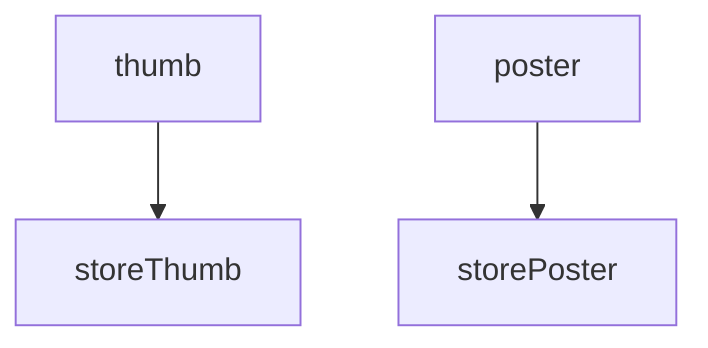

# Demo

## Hello, world

Run live example: `php demo/hello-world.php Rodolfo` - [view source](./demo/hello-world.php)

The basic example Workflow defines a greet for a given username. The job `greet` is a named argument and it takes the `GreetAction` plus its [main method](https://chevere.org/packages/action#main-method) arguments. The `run` function is used to execute the Workflow.

```php
use Chevere\Demo\Actions\Greet;
use function Chevere\Workflow\run;
use function Chevere\Workflow\sync;
use function Chevere\Workflow\variable;
use function Chevere\Workflow\workflow;

$workflow = workflow(
    greet: sync(
        new Greet(),
        username: variable('username'),
    ),
);
$run = run(
    $workflow,
    username: $argv[1] ?? 'World'
);
$greet = $run->getReturn('greet')->string();
echo <<<PLAIN
{$greet}

PLAIN;
```

The graph for this Workflow contains only the `greet` job.

```php
$workflow->jobs()->graph()->toArray();
// contains
[
    ['greet'],
];
```

## Image resize example (async)

Run live example: `php demo/image-resize.php` - [view source](./image-resize.php)

For this example Workflow defines an image resize procedure in two sizes. All jobs are defined as async, but as there are dependencies between jobs (see `variable` and `response`) the system resolves a suitable run strategy.

```php
use Chevere\Demo\Actions\ImageResize;
use Chevere\Demo\Actions\StoreFile;
use function Chevere\Workflow\async;
use function Chevere\Workflow\response;
use function Chevere\Workflow\run;
use function Chevere\Workflow\variable;
use function Chevere\Workflow\workflow;

$workflow = workflow(
    thumb: async(
        new ImageResize(),
        file: variable('image'),
        fit: 'thumbnail',
    ),
    poster: async(
        new ImageResize(),
        file: variable('image'),
        fit: 'poster',
    ),
    storeThumb: async(
        new StoreFile(),
        file: response('thumb'),
        dir: variable('saveDir'),
    ),
    storePoster: async(
        new StoreFile(),
        file: response('poster'),
        dir: variable('saveDir'),
    )
);
$run = run(
    $workflow,
    image: __DIR__ . '/src/php.jpeg',
    saveDir: __DIR__ . '/src/output/',
);
```

The graph for the Workflow above shows that `thumb` and `poster` run async, just like `storeThumb` and `storePoster` but the `store*` jobs run after the first dependency level gets resolved.



```php
$workflow->jobs()->graph()->toArray();
// contains
[
    ['thumb', 'poster'],
    ['storeThumb', 'storePoster']
];
```

Use function `run` to run the Workflow, variables are passed as named arguments.

```php
use function Chevere\Workflow\run;

$run = run(
    $workflow,
    image: '/path/to/image-to-upload.png',
    savePath: '/path/to/storage/'
);
```

Use `getReturn` to retrieve a job response as a `CastArgument` object which can be used to get a typed response.

```php
$thumbFile = $run->getReturn('thumb')->string();
```

## Sync vs Async

Run live example: `php demo/sync-vs-async.php` - [view source](./sync-vs-async.php)

For this example you can compare the execution time between synchronous and asynchronous jobs. The example fetches the content of three URLs using `FetchUrl` action.

```php
use Chevere\Demo\Actions\FetchUrl;
use function Chevere\Workflow\async;
use function Chevere\Workflow\run;
use function Chevere\Workflow\sync;
use function Chevere\Workflow\variable;
use function Chevere\Workflow\workflow;

$sync = workflow(
    j1: sync(
        new FetchUrl(),
        url: variable('php'),
    ),
    j2: sync(
        new FetchUrl(),
        url: variable('github'),
    ),
    j3: sync(
        new FetchUrl(),
        url: variable('chevere'),
    ),
);
$async = workflow(
    j1: async(
        new FetchUrl(),
        url: variable('php'),
    ),
    j2: async(
        new FetchUrl(),
        url: variable('github'),
    ),
    j3: async(
        new FetchUrl(),
        url: variable('chevere'),
    ),
);
$variables = [
    'php' => 'https://www.php.net',
    'github' => 'https://github.com/chevere/workflow',
    'chevere' => 'https://chevere.org',
];
$time = microtime(true);
$run = run($sync, ...$variables);
$time = round((microtime(true) - $time) * 1000);
echo "Time (ms)  sync: {$time}\n";

$time = microtime(true);
$run = run($async, ...$variables);
$time = round((microtime(true) - $time) * 1000);
echo "Time (ms) async: {$time}\n";
```

When running sync (blocking) jobs the execution time is higher than async (non-blocking) jobs. This is because async jobs run in parallel.

```plain
Time (ms)  sync: 2307
Time (ms) async: 1119
```

## Conditional jobs

Run live example: `php demo/run-if.php` - [view source](./run-if.php)

For this example Workflow defines a greet for a given username, but only if a `sayHello` variable is set to `true`.

```php
use Chevere\Demo\Actions\Greet;
use function Chevere\Workflow\run;
use function Chevere\Workflow\sync;
use function Chevere\Workflow\variable;
use function Chevere\Workflow\workflow;

/*
php demo/run-if.php Rodolfo
php demo/run-if.php
*/

$workflow = workflow(
    greet: sync(
        new Greet(),
        username: variable('username'),
    )->withRunIf(
        variable('sayHello')
    ),
);
```

Method `withRunIf` accepts one or more `variable` and `response` references. All conditions must be true at the same time for the job to run.
